# bamazon

# A Node.js & MySQL application

## Overview

This project is an Amazon-like storefront which utilizes a MySQL database. The app takes in orders from customers and depletes stock from the store's inventory. As a bonus the app also tracks product sales across your store's departments and then provide a summary of the highest-grossing departments in the store.

## Customer View 

### The Database Setup

1. Using a MySQL Database called `bamazon`.

2. We create a Table inside of that database called `products`.

3. The products table has each of the following columns:

   * item_id (unique id for each product)

   * product_name (Name of product)

   * department_name

   * price (cost to customer)

   * stock_quantity (how much of the product is available in stores)

## The Customer Application

4. Then create a Node application called `bamazonCustomer.js`. Running this application will first display all of the items available for sale. Include the ids, names, and prices of products for sale.

5. The app then prompts users with two messages.

   * The first asks for the ID of the product they would like to buy.
   * The second message ask how many units of the product they would like to buy.

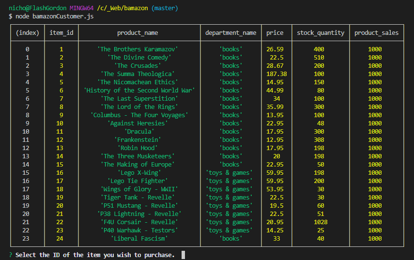

6. Once the customer has placed the order, the application checks if the store has enough of the product to meet the customer's request.

```js
 // Check inventory
      var SQL = 'SELECT item_id, product_name, stock_quantity, price FROM products WHERE item_id = ' + mysql.escape(answer.itemID);
      //console.log("[SQL] " + SQL)
      connection.query(SQL, function (err, res) {
        if (err) throw err;
        var totalAvailable = parseInt(res[0].stock_quantity);
        if (totalAvailable < parseInt(answer.quantity)) {
          console.log("Insufficient quantity!");
          connection.end();
          return;
        } else {
          // subtract the quantity ordered from the totalAvailable
          var newTotal = parseInt(res[0].stock_quantity) - parseInt(answer.quantity);
          // show the total price: quantity * price
          var totalPrice = answer.quantity * parseFloat(res[0].price);
          //  then update the db
          var updateSQL = 'UPDATE products SET stock_quantity=' + mysql.escape(newTotal) + ' WHERE item_id=' + mysql.escape(answer.itemID);
          connection.query(updateSQL, function (err, res2) {
            if (err) throw err;
            if (answer.quantity > 1) {
              console.log("Items purchased!")
            } else {
              console.log("Item purchased!")
            }
            console.log("Total Price: $" + totalPrice)
          });
        }
        connection.end();
      })
    });
```

   * If not, the app logs: `Insufficient quantity!` to the screen, and then prevents the order from going through.

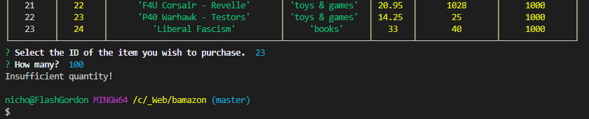

8. However, if the store _does_ have enough of the product, the application will fulfill the customer's order.

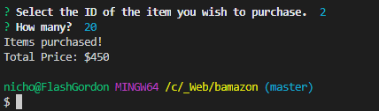

- - -


- - -

### Manager View

* Using the same database `bamazon` the next Node application `bamazonManager.js` does the following:

  * List a set of menu options:

    * View Products for Sale
    
    * View Low Inventory
    
    * Add to Inventory
    
    * Add New Product

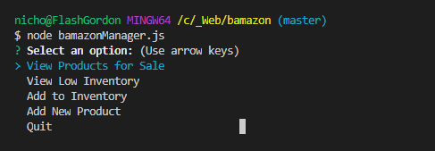

  * If a manager selects `View Products for Sale`, the app should list every available item: the item IDs, names, prices, and quantities.

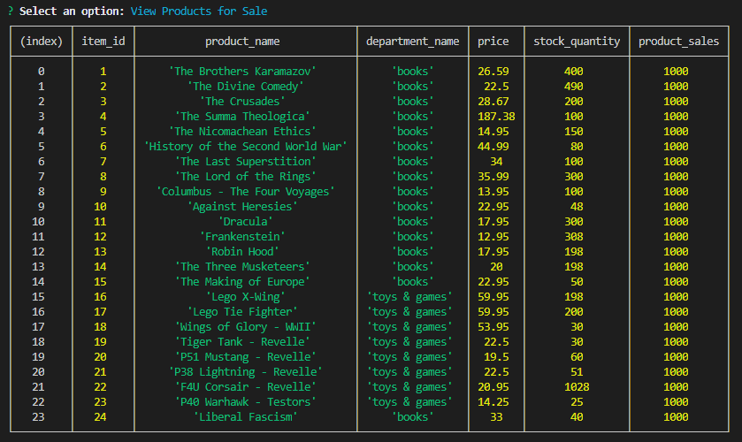

  * If a manager selects `View Low Inventory`, then it should list all items with an inventory count lower than five.

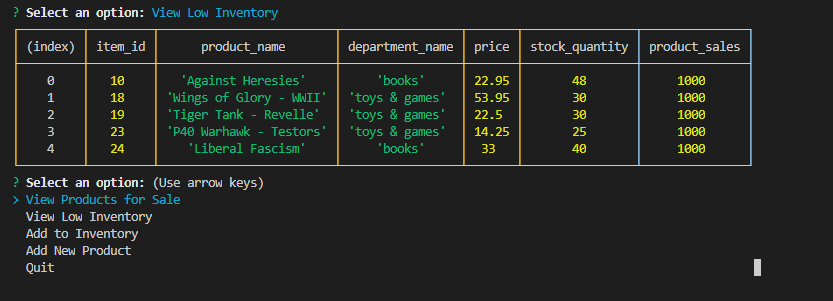

  * If a manager selects `Add to Inventory`, your app should display a prompt that will let the manager "add more" of any item currently in the store.

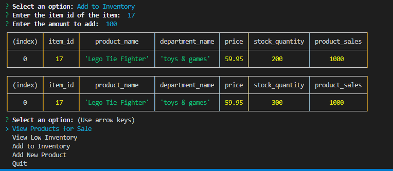

  * If a manager selects `Add New Product`, it should allow the manager to add a completely new product to the store.

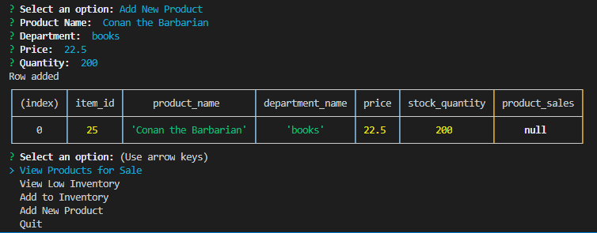

- - -

### Supervisor View

1. For this application, we need to create a new MySQL table called `departments`. The table includes the following columns:

   * department_id

   * department_name

   * over_head_costs

2. Modify the products table so that there's a product_sales column, and modify your `bamazonCustomer.js` app so that when a customer purchases anything from the store, the price of the product multiplied by the quantity purchased is added to the product's product_sales column.

```js
  // get product_sales
  var productSales = parseFloat(res[0].product_sales);
  var newProductSales = totalPrice + productSales;
  // now update product_sales
  var updateSQL = 'UPDATE products SET product_sales=' + mysql.escape(newProductSales) + ' WHERE item_id=' + mysql.escape(answer.itemID);
  connection.query(updateSQL, function (err, res2) {
    if (err) throw err;
    console.log("Total Product Sales: $" + newProductSales)
  });
```

3. Create another Node app called `bamazonSupervisor.js`. Running this application will list a set of menu options:

   * View Product Sales by Department
   
   * Create New Department

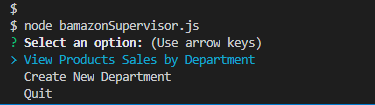


4. When a supervisor selects `View Product Sales by Department`, the app displays a summarized table in their terminal/bash window. For example:

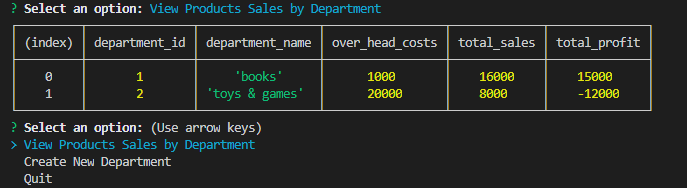

5. The `total_profit` column is calculated on the fly using the difference between `over_head_costs` and `product_sales`. `total_profit` is not be stored in any database. I used a custom alias and subselect to affect this outcome.

* Using backticks, I was able to use this SQL to get the correct results:

```js
var SQL = `select 
  b.department_id, 
  b.department_name, 
  b.over_head_costs, 
  total_sales,
  sum(total_sales - b.over_head_costs) as total_profit
from departments b
  left join (select a.department_name, sum(a.product_sales) as total_sales 
  from products a 
  group by a.department_name) as x on x.department_name = b.department_name
group by b.department_id, total_sales;
`
```

6. The user can select `Create New Department` to create a new department.

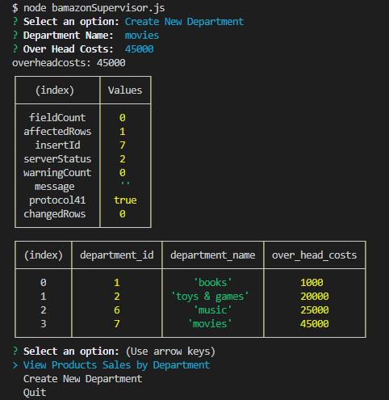

* Additionaly, here is a link to the Github Repository.


